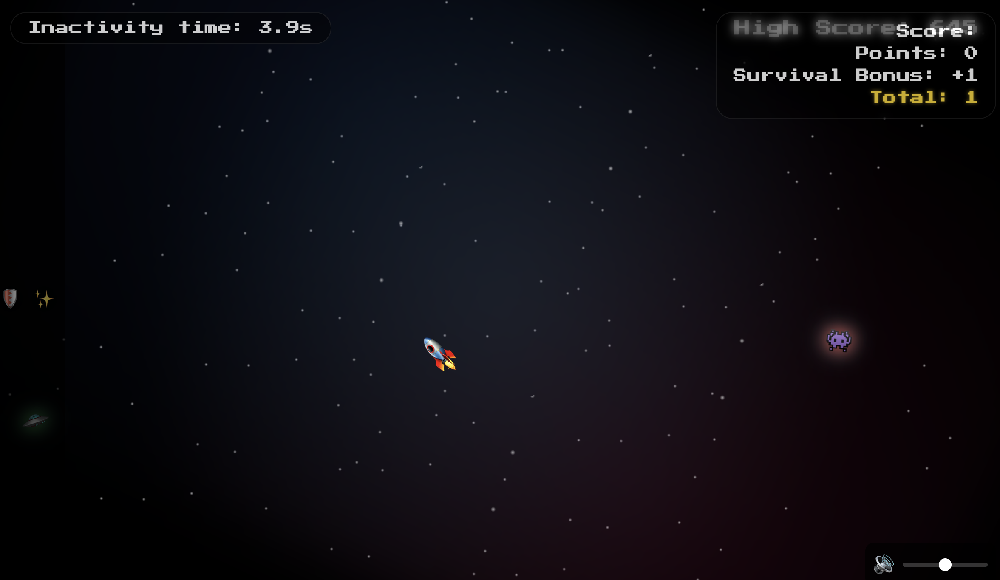

# Galaxy Fighter 

A fun little browser game where you move a rocket cursor around a spacey background, collect power-ups, and dodge obstacles. Made just for the vibes and to play with cool CSS/JS effects.

> **Note:** This game is currently not supported on mobile devices, since it's a cursor-based game. (Duh!)

## How to Play
- Move your mouse (or finger on mobile) to control the rocket
- Grab power-ups, avoid baddies, rack up your score
- Try to beat your high score!

## Features
- Animated stars & nebula background
- Combo & power-up system
- Particle trails and bursts
- Sound effects (with volume control)
- Works on desktop and mobile

## Tech
- HTML, CSS, JavaScript (no frameworks)
- Web Audio API for sounds

## To Play
Just open `https://rahu619.github.io/galaxy-fighter/` or clone the project and open `index.html` in your browser. That's it!

---

This is a casual, for-fun project. Enjoy! 🚀 